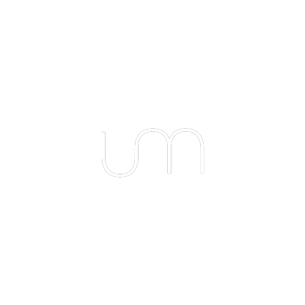

<p align="center">
  
<h1 align="center">Umium</h1>
<p align="center">
  <strong>Umium</strong> is a security-focused anti-debugging and anti-reverse engineering library designed for high-resilience Windows 10/11 x64 applications. It uses a combination of undocumented Windows NT system functions and advanced runtime modifications to detect and neutralize debugging, memory tampering, or sandboxing attempts.
</p>
</p>
<p align="center">
  
  
</p>
</p>

</br></br>

## Usage

Umium is a **single-header library**. Drop `umium.hpp` into your project.

In **exactly one** `.cpp` file, define `UMIUM_IMPLEMENTATION` before including the header:

```cpp
// main.cpp (or any single TU)
#define UMIUM_IMPLEMENTATION
#include "umium.hpp"

int main()
{
    umium::get().start();
    // ...
}
```

Every other translation unit that only needs the type:

```cpp
#include "umium.hpp"
```

No separate compilation step, no static/shared library — just the header.

## Requirements

- **Windows 10 / 11**, x86-64 only
- **Compiler**: Clang (trunk) or MSVC with C++20+; C++26 recommended

## Contributing
Pull requests are welcome. For major changes, please open an issue first to discuss what you would like to change.

## License
[MIT](https://choosealicense.com/licenses/mit/)

## 💵 Want to buy me a Coffee?
     - Donate BTC at `3HGhL4ygYrMMhncpWCGDJg9DbKSndgNiGX`
     - Donate ETH at `0x531ea7dcd99bed442a92c985f853dc6892876c40`
     - Donate LTC at `LXFmz25B36d3XcergMd4ttCjXPX9FnYTn6`
     - Donate TRX at `TExNFUbP8W6eCZqB31AKLSVQFCqDLjYmr9`
